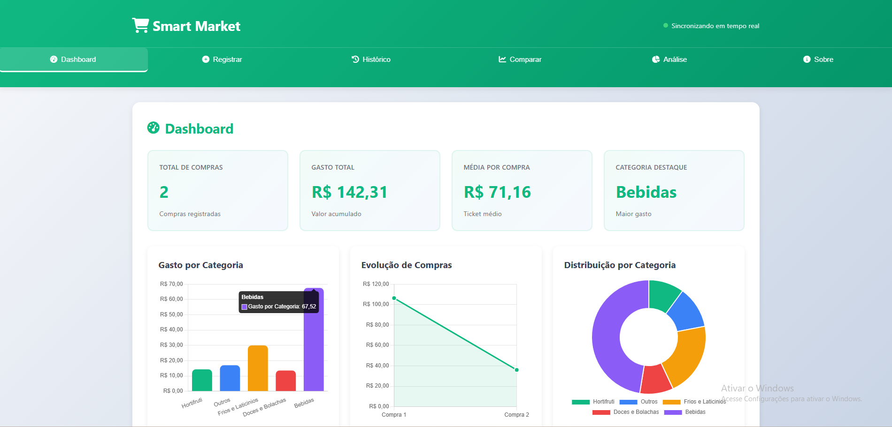
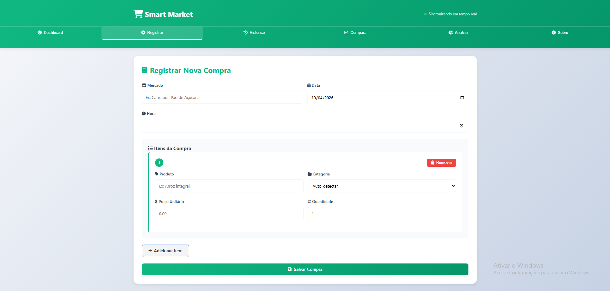
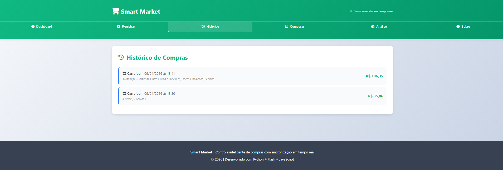
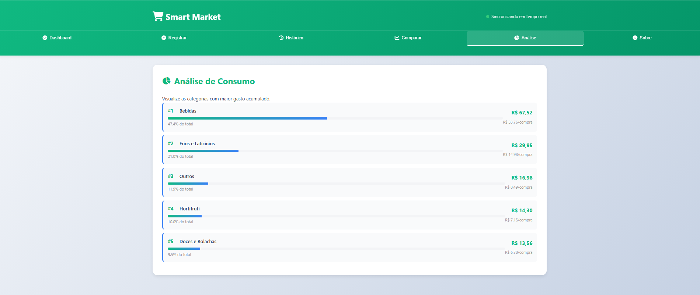

<!-- ========================= -->
<!--        SMART MARKET       -->
<!-- ========================= -->

<p align="center">
  
</p>

<h1 align="center">🛒 Smart Market</h1>

<p align="center">
  <strong>Controle inteligente de compras com Python, Flask, JSON e análise de consumo</strong>
</p>

<p align="center">
  Sistema desenvolvido para registrar compras, comparar períodos e transformar gastos em dados.
</p>

---

<p align="center">
  
  
  
  
</p>

---

## 📌 Visão Geral

O **Smart Market** é um projeto em Python criado para transformar compras de supermercado em dados analisáveis.

- registrar compras  
- salvar histórico  
- comparar períodos  
- analisar consumo  

---

## 🚀 Objetivo

- Aplicar Python na prática  
- Criar portfólio  
- Resolver problema real  
- Evoluir para app/web  

---

## ✨ Funcionalidades

### Registro
- cadastro de compras  
- múltiplos itens  
- valores e categorias  

### Histórico
- visualização de compras  
- valores e categorias  

### Comparação
- comparação entre compras  

### Análise
- ranking de categorias  
- consumo por categoria  

---

## 🖥️ Interface

- Dashboard com métricas  
- Registro de compra  
- Histórico  
- Comparação  
- Análise  

---

## 📷 Screenshots

> Crie a pasta `assets/` e adicione imagens

```md




```

---

## 🛠️ Tecnologias

| Tecnologia | Uso |
|----------|------|
| Python | Lógica |
| Flask | Backend |
| HTML | Interface |
| CSS | Estilo |
| JavaScript | Interação |
| Chart.js | Gráficos |
| JSON | Dados |

---

## 🧱 Arquitetura

```bash
SMART_MARKET/
├── data/
├── interface/
├── models/
├── services/
├── utils/
├── app.py
├── index.html
├── main.py
└── requirements.txt
```

---

## 📂 Organização

| Camada | Função |
|------|--------|
| models | dados |
| services | lógica |
| utils | auxiliares |
| data | JSON |
| interface | UI |
| app.py | backend |
| main.py | terminal |

---

## 🔍 Fluxo

```text
Cadastro
 ↓
Validação
 ↓
Categorização
 ↓
Cálculo
 ↓
JSON
 ↓
Dashboard
 ↓
Análise
```

---

## 🧠 Categorização

- normalização  
- palavras-chave  
- estrutura para IA  
- fallback: "Outros"  

---

## 📊 Métricas

- total de compras  
- gasto total  
- ticket médio  
- categorias  
- evolução  

---

## ⚙️ Instalação

```bash
git clone https://github.com/Dinox75/Smart_market.git
cd Smart_market
python -m venv venv
```

### Ativar

Windows:
```bash
venv\Scripts\activate
```

Linux/Mac:
```bash
source venv/bin/activate
```

### Instalar

```bash
pip install -r requirements.txt
```

### Rodar

```bash
python main.py
```

```bash
python app.py
```

---

## 💡 Uso

### Registrar
- mercado  
- data  
- itens  
- preço  

### Histórico
- visualizar compras  

### Comparar
- comparar compras  

### Analisar
- categorias  

---

## 📈 Roadmap

### Concluído
- [x] registro  
- [x] histórico  
- [x] comparação  
- [x] análise  
- [x] dashboard  

### Próximos
- [ ] IA real  
- [ ] peso vs unidade  
- [ ] exportação  
- [ ] OCR  
- [ ] app  

---

## 📚 Aprendizados

- POO  
- JSON  
- arquitetura  
- validação  
- frontend/backend  

---

## 🤝 Contribuição

```bash
git checkout -b feature/nova-feature
git commit -m "feat: nova feature"
git push origin feature/nova-feature
```

---

## 📌 Status

Em desenvolvimento.

---

## 👨‍💻 Autor

Vinicius Lima  

GitHub: https://github.com/Dinox75  
LinkedIn: https://www.linkedin.com/in/vinicius-limajr/

---

## ⭐ Apoie

Deixe uma estrela ⭐

---

<p align="center">
Smart Market • Projeto de portfólio
</p>
